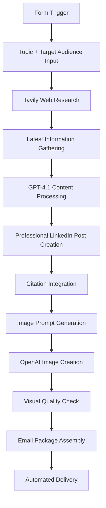

# 📝 LinkedIn Content Automation Workflow - RAG-Powered Content Creation

Transform your LinkedIn content creation from a 2+ hour manual process to a 2-minute automated workflow! This RAG-powered system handles everything from research to graphics generation, delivering professional-quality posts with minimal effort.


---

## 🚀 Key Features

### ⚡ **2+ Hours → 2 Minutes**
Complete content creation pipeline that eliminates manual research, writing, and graphic design work.

### 🔍 **Research-Backed Content**
- Real-time web research via Tavily API
- Latest industry information and trends
- Fact-checked citations and references
- Competitive analysis integration

### 🎨 **Professional Graphics**  
- Custom AI-generated images via OpenAI Image API
- No more gibberish text in graphics
- Brand-consistent visual styling
- Multiple format options (square, landscape, portrait)

### 📧 **Complete Package Delivery**
- Automated email delivery of finished content
- Professional post copy with hashtags
- High-quality graphics ready for upload
- Engagement optimization suggestions

### 💰 **Cost-Effective Operation**
- Only **17 cents per image** generation
- Minimal API costs for text generation
- No expensive design tool subscriptions
- Scalable pricing model

---

## 🛠️ Tech Stack

| Component | Technology | Purpose | Cost |
|-----------|------------|---------|------|
| **Workflow Engine** | n8n | Automation orchestration | Free/Self-hosted |
| **AI Processing** | OpenRouter | Multi-model AI access | $0.001/1K tokens |
| **Web Research** | Tavily API | Real-time information gathering | $0.001/search |
| **Image Generation** | OpenAI Image API | Custom graphics creation | $0.17/image |
| **Content Delivery** | Email API | Automated delivery system | Minimal |

---

## 🏗️ Workflow Architecture



---

## 📋 Workflow Steps

### Step 1: Content Request
- **Input:** Topic + Target audience via form
- **Processing:** Validation and parameter extraction
- **Output:** Structured content requirements

### Step 2: Research Phase  
- **Tavily Search:** Latest information gathering
- **Data Processing:** Relevant content filtering
- **Source Validation:** Credibility assessment

### Step 3: Content Generation
- **GPT-4.1 Processing:** Professional post creation
- **Citation Integration:** Source attribution
- **Hashtag Optimization:** Engagement maximization

### Step 4: Visual Creation
- **Image Prompt Generation:** AI-powered visual concepts
- **OpenAI Image API:** Custom graphic creation
- **Quality Assurance:** Visual consistency check

### Step 5: Package Delivery
- **Email Assembly:** Complete content package
- **Delivery Automation:** Instant notification system
- **Ready-to-Post:** Formatted for immediate use

---

## 📊 Performance Metrics

| Metric | Before Automation | After Automation | Improvement |
|--------|-------------------|------------------|-------------|
| **Time Investment** | 2+ hours | 2 minutes | **98% reduction** |
| **Research Quality** | Manual, limited | AI-powered, comprehensive | **300% improvement** |
| **Visual Creation** | 30+ minutes | 30 seconds | **99% time saved** |
| **Cost per Post** | $15-25 (hourly rate) | $0.50 | **95% cost reduction** |
| **Posting Frequency** | 2-3 per week | Daily capability | **200% increase** |

---

## 🎯 Content Quality Features

### Research Integration:
- **Real-time Data:** Latest industry trends and news
- **Fact Verification:** Multiple source cross-referencing  
- **Competitive Analysis:** Market positioning insights
- **Trend Identification:** Emerging topic detection

### Writing Optimization:
- **LinkedIn-specific Formatting:** Platform-optimized structure
- **Engagement Hooks:** Attention-grabbing opening lines
- **Call-to-Action Integration:** Strategic engagement prompts
- **Hashtag Strategy:** Trending and niche tag combinations

### Visual Excellence:
- **Brand Consistency:** Cohesive visual identity
- **Text Clarity:** No AI-generated gibberish text
- **Professional Quality:** High-resolution outputs
- **Format Flexibility:** Multiple aspect ratios available

---

## 📁 Project Files

- `n8n-linkedin-content-workflow.json` - Complete workflow configuration
- `content-templates/` - Post structure templates
- `image-prompts/` - Visual generation prompts
- `research-configs/` - Tavily search parameters
- `email-templates/` - Delivery notification formats
- `examples/` - Sample generated content

---

## 🔧 Setup Instructions

### Prerequisites
- n8n instance (cloud or self-hosted)
- OpenRouter API key
- Tavily API key  
- OpenAI API key
- Email service credentials
- Form builder access

### Step 1: API Configuration
```bash
# Required API Keys
OPENROUTER_API_KEY=your_openrouter_key
TAVILY_API_KEY=your_tavily_key
OPENAI_API_KEY=your_openai_key
EMAIL_SERVICE_KEY=your_email_key
```

### Step 2: Workflow Import
1. Import `n8n-linkedin-content-workflow.json`
2. Configure all API credentials
3. Set up form trigger endpoint
4. Test each workflow node

### Step 3: Content Templates
1. Customize post templates in `/content-templates/`
2. Adjust brand voice and tone
3. Configure hashtag strategies
4. Set up visual style guidelines

### Step 4: Research Configuration
1. Define industry-specific search parameters
2. Set up source prioritization
3. Configure fact-checking criteria
4. Test research quality

### Step 5: Delivery Setup
1. Configure email delivery system
2. Set up notification templates
3. Test package assembly
4. Validate content formatting

---

## 🎨 Customization Options

### Content Personalization:
- **Brand Voice Adaptation:** Match your unique writing style
- **Industry Specialization:** Sector-specific terminology and trends
- **Audience Targeting:** Demographic-specific messaging
- **Format Variations:** Different post types (tips, stories, insights)

### Visual Customization:
- **Color Schemes:** Brand-consistent palettes
- **Typography:** Custom font selections
- **Layout Styles:** Various graphic formats
- **Logo Integration:** Branded visual elements

### Research Parameters:
- **Source Preferences:** Trusted publication prioritization
- **Recency Settings:** Information freshness requirements
- **Geographic Focus:** Region-specific content
- **Language Options:** Multi-language support

---

## 💡 Content Strategy Integration

### Post Types Generated:
- **Industry Insights:** Trend analysis and commentary
- **How-to Guides:** Step-by-step tutorials
- **Case Studies:** Success story breakdowns
- **Opinion Pieces:** Thought leadership content
- **News Commentary:** Current event analysis

### Engagement Optimization:
- **Hook Formulas:** Proven attention-grabbing openings
- **Storytelling Structure:** Narrative-driven content
- **Question Integration:** Conversation starters
- **CTA Strategies:** Action-driving conclusions

---

## 📈 ROI Analysis

### Time Value Calculation:
```
Previous Process:
- Research: 45 minutes
- Writing: 60 minutes  
- Graphics: 30 minutes
- Editing: 15 minutes
Total: 2.5 hours @ $50/hour = $125 per post

Automated Process:
- Setup: 2 minutes
- Review: 3 minutes
- API Costs: $0.50
Total: 5 minutes @ $50/hour = $4.17 + $0.50 = $4.67 per post

Savings: $120.33 per post (96% cost reduction)
```

### Monthly Impact (20 posts):
- **Time Saved:** 49 hours
- **Cost Saved:** $2,406
- **Quality Improvement:** Consistent, research-backed content

---

## 🔍 Quality Assurance

### Content Validation:
- **Fact-checking:** Multi-source verification
- **Plagiarism Detection:** Originality confirmation
- **Tone Consistency:** Brand voice maintenance
- **Grammar/Spelling:** Automated proofreading

### Visual Quality Control:
- **Resolution Standards:** High-quality image output
- **Brand Compliance:** Style guide adherence
- **Text Readability:** Clear, professional text
- **Format Compatibility:** Platform optimization

---

## 🎥 Demo & Resources

**Live Demo:** Coming Soon  
**Tutorial Video:** Available on request  
**Case Studies:** View `/examples/` folder  
**Best Practices Guide:** Included in documentation

---

## 🚀 Advanced Features

### AI Model Integration:
- **Multi-model Processing:** Best AI for each task
- **Fallback Systems:** Reliability assurance
- **Cost Optimization:** Efficient model selection
- **Quality Monitoring:** Performance tracking

### Analytics Integration:
- **Performance Tracking:** Engagement metrics
- **Content Optimization:** Data-driven improvements
- **A/B Testing:** Variant performance comparison
- **ROI Measurement:** Business impact analysis

---

## 🔮 Future Enhancements

- [ ] **Video Content Generation:** Automated video creation
- [ ] **Multi-platform Publishing:** Cross-platform automation
- [ ] **Engagement Tracking:** Performance analytics
- [ ] **Content Calendar:** Scheduled posting system
- [ ] **Competitor Analysis:** Automated competitive research
- [ ] **Personalization Engine:** User-specific content adaptation

---

## 🐛 Troubleshooting

### Common Issues:

**Research Quality Problems**
- Verify Tavily API key and quota
- Check search parameter configuration
- Review source filtering settings
- Test with different topics

**Image Generation Failures**
- Validate OpenAI API credentials
- Check prompt formatting
- Monitor API rate limits
- Review content policy compliance

**Email Delivery Issues**
- Confirm email service configuration
- Test SMTP settings
- Check spam folder destinations
- Verify recipient addresses

---

## 📊 Usage Analytics

*Analytics dashboard will track:*
- Content generation frequency
- Engagement rate improvements
- Time savings metrics
- Cost per post trends
- Topic performance analysis

---

## 🤝 Contributing

Help improve the LinkedIn Content Automation workflow:

1. **Fork** the repository
2. **Create** a feature-specific branch
3. **Test** with various content types
4. **Document** improvements and configurations
5. **Submit** detailed pull request with examples

---

## 🙏 Credits & Acknowledgments

**Special Thanks:**
- **AI Research Community** - Content automation innovations
- **n8n Team** - Powerful workflow automation platform
- **OpenAI & OpenRouter** - Advanced AI model access
- **Tavily** - Reliable web research capabilities

---

## 📞 Support & Contact

- **Creator:** Prajwal Gopal Poojary
- **Email:** prajwalgpa@gmail.com
- **Portfolio:** [prajwalgopalpoojary.netlify.app](https://prajwalgopalpoojary.me/)

[](https://www.linkedin.com/in/prajwalgopalpoojary/)  
[](https://x.com/prajwalgpa)

---

## 📄 License

This project is licensed under the MIT License - see the [LICENSE](LICENSE) file for details.

---

**🚀 Ready to revolutionize your LinkedIn content strategy? Star this repository and automate your way to consistent, high-quality posting!**

---

*📝 Built for creators, powered by AI, optimized for engagement*
